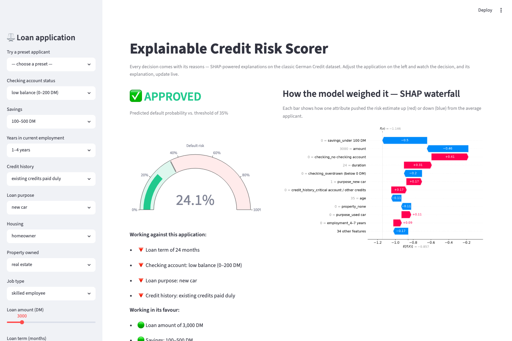

# ⚖️ Explainable Credit Risk Scorer

**Every credit decision comes with its reasons — SHAP-powered explanations on the classic German Credit dataset.**

**▶ Live demo: https://drishtant-credit-risk.streamlit.app**

Fill in a loan application and get an instant approve/decline decision — plus a SHAP waterfall showing exactly how each attribute moved the risk estimate, plain-English reasons for and against, and actionable guidance on what could change the outcome.



## What it shows

- **Interactive scoring** — a 13-field loan application scored live by XGBoost, with an adjustable approval threshold
- **Decision explanations** — SHAP waterfall per application, aggregated from one-hot features back to human terms, with auto-generated reasons ("Working against this application: overdrawn checking account…")
- **Adverse-action guidance** — declined applicants see what would most improve their odds, mirroring real lending regulation (adverse action notices / "right to explanation")
- **Preset personas** — recent graduate, established homeowner, overextended borrower — for one-click exploration
- **Fairness by design** — the dataset includes sex and nationality; this model **deliberately excludes both**. Protected characteristics have no place in a credit decision, and the model card says so out loud.

## How it works

```
data_prep.py  →  loads UCI German Credit, decodes attribute codes to readable labels,
                 one-hot encodes with stable column order
model.py      →  XGBoost classifier (no class re-weighting, so predicted probabilities
                 stay calibrated to the 30% base default rate)
                 SHAP TreeExplainer + plain-English reason/advice generation
app.py        →  Streamlit UI: application form, risk gauge, waterfall, guidance
```

Held-out performance: **ROC-AUC ≈ 0.80** — honest numbers for this dataset; the famous result that checking-account status dominates German Credit predictions is plainly visible in the SHAP output.

## Data

[**Statlog (German Credit Data)**](https://archive.ics.uci.edu/dataset/144/statlog+german+credit+data) — UCI Machine Learning Repository. 1,000 anonymised loan applications from a 1990s German bank (700 repaid, 300 defaulted); amounts are in Deutsche Mark. The raw file ships in [`data/german.data`](data/german.data) with original attribute codes; `data_prep.py` documents the decoding.

## Run it locally

```bash
git clone https://github.com/drishtantleuva/credit-risk-scorer.git
cd credit-risk-scorer
python3 -m venv venv && source venv/bin/activate
pip install -r requirements.txt
streamlit run app.py
```

macOS users: XGBoost needs OpenMP — `brew install libomp`.

## Disclaimer

Educational demonstration of explainable credit decisioning on a historical research dataset. Not a real lending system, and not financial advice.

---

Built by **Drishtant Leuva** — Data Scientist specialising in anomaly detection, risk analytics and explainable GenAI. Master's research: *Explainable AI in Financial Risk Modelling*.
[LinkedIn](https://www.linkedin.com/in/drishtant-leuva/) · drishtantl@gmail.com
